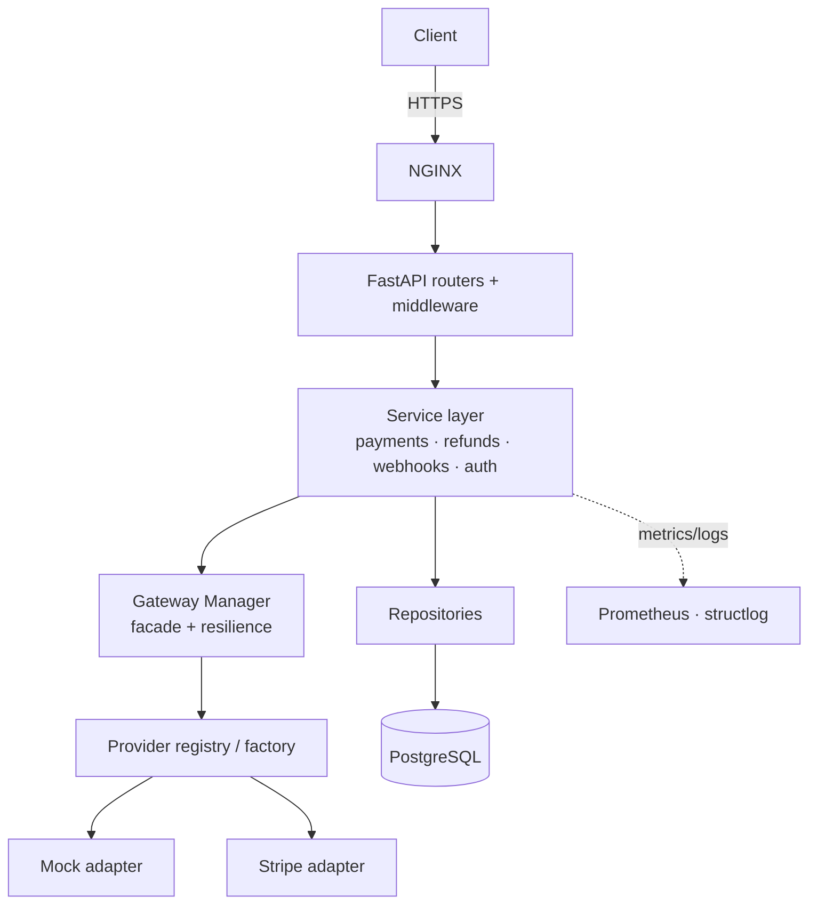

# Universal Payment Gateway Integration (UPGI)

A unified, provider-agnostic payment orchestration API. UPGI hides the
complexity of individual payment providers behind **one clean, secure interface**,
so an application integrates a single API and gains many gateways — adding a new
provider never requires touching business logic.

Built with FastAPI, SQLAlchemy 2 (async), and a strong security posture:
envelope-encrypted provider credentials, Argon2id password hashing, JWT + API
keys, idempotency, webhook signature verification with replay protection, SSRF
guards, rate limiting, and a circuit breaker around every outbound call.

---

## Highlights

- **Provider-agnostic core** — a single `BasePaymentProvider` adapter interface.
  A plugin **registry + factory** resolves providers by name. Ships with a fully
  functional **sandbox/mock** provider and a **Stripe** adapter.
- **Full payment lifecycle** — create, authorize, capture (full/partial), cancel,
  and refund (full/partial), enforced by an explicit **state machine**.
- **Idempotency** — `Idempotency-Key` header makes create/refund safe to retry.
- **Secure by default** — see [Security](#security).
- **Resilient** — retry with jittered backoff + a per-provider **circuit breaker**
  that distinguishes infrastructure failures from business declines.
- **Observable** — structured JSON logs with correlation ids, Prometheus metrics,
  health/readiness probes.
- **Production tooling** — Docker multi-stage build, docker-compose (API +
  PostgreSQL + Redis + NGINX), Alembic migrations, GitHub Actions CI, Ruff/Black/Mypy,
  and a Pytest suite with high coverage.

## Architecture

Clean, layered architecture with clear boundaries. Dependencies point inward:
the domain and services never import the web framework.



Layout:

```
app/
├── api/            # FastAPI routers, dependency wiring, error handlers
├── core/           # config, logging, money, errors, resilience, metrics, rate-limit
├── domain/         # enums, RBAC scopes, payment state machine
├── db/             # async engine/session + ORM models
├── repositories/   # persistence (the only layer touching the ORM directly)
├── services/       # business logic / orchestration
├── providers/      # provider adapters + plugin registry (mock, stripe)
├── security/       # passwords, JWT, API keys, AES-GCM crypto, SSRF, signatures
├── middleware/     # correlation id, security headers, rate limiting
└── schemas/        # Pydantic request/response contracts
```

Design patterns applied: Adapter, Strategy, Factory, Registry/Plugin, Facade,
Repository, Service Layer, and Dependency Injection (via FastAPI's `Depends`).

## Quickstart

Requires Python 3.12+.

```bash
python -m venv .venv
# Windows: .venv\Scripts\activate   |   Unix: source .venv/bin/activate
pip install -e ".[dev]"

# Generate secrets and create your .env
cp .env.example .env
python -m app generate-key        # paste into UPGI_SECRET_ENCRYPTION_KEY

# Run the API (auto-creates the schema in non-production)
python -m app serve --reload
```

Open the interactive docs at <http://localhost:8000/docs>.

### With Docker

```bash
docker compose up --build -d
# API behind NGINX at http://localhost:8080
```

## API walkthrough

```bash
# 1. Register and log in
curl -s localhost:8000/api/v1/auth/register -H 'content-type: application/json' \
  -d '{"email":"me@example.com","password":"correct horse battery"}'

TOKEN=$(curl -s localhost:8000/api/v1/auth/login -H 'content-type: application/json' \
  -d '{"email":"me@example.com","password":"correct horse battery"}' | jq -r .access_token)

# 2. Create a payment (mock/sandbox provider works out of the box)
curl -s localhost:8000/api/v1/payments -H "authorization: Bearer $TOKEN" \
  -H 'content-type: application/json' -H 'Idempotency-Key: order-1001' \
  -d '{"provider":"mock","amount_minor":4999,"currency":"USD","description":"Pro plan"}'

# 3. Refund part of it
curl -s localhost:8000/api/v1/payments/<PAYMENT_ID>/refunds -H "authorization: Bearer $TOKEN" \
  -H 'content-type: application/json' -d '{"amount_minor":2000,"reason":"partial"}'
```

Authenticate with either a **Bearer JWT** (`Authorization: Bearer …`) or an
**API key** (`X-API-Key: upgi_sk_…`) created via `POST /api/v1/auth/api-keys`.

## Security

| Area | Approach |
|------|----------|
| Passwords | Argon2id, transparent re-hash on parameter upgrade |
| Sessions | JWT access/refresh with `iss`/`aud`/`exp`/`jti`; typed tokens |
| API keys | Only a SHA-256 hash is stored; shown once at creation |
| Provider secrets | AES-256-GCM envelope encryption with key rotation + AAD |
| Webhooks | HMAC-SHA256 signature + timestamp replay window; idempotent processing |
| SSRF | Outbound URLs validated; private/loopback/metadata IPs blocked |
| Idempotency | Persisted per (owner, endpoint, key) with request-hash conflict detection |
| Transport | Rate limiting, strict security headers, CORS allow-list, TLS/HSTS via proxy |
| Data | No floats for money (integer minor units); no secrets in logs (redaction) |

See [docs/SECURITY.md](docs/SECURITY.md) for the full model and OWASP mapping.

## Adding a provider

1. Create `app/providers/<name>.py` implementing `BasePaymentProvider`.
2. Decorate it with `@register_provider(ProviderName.<NAME>)`.
3. Add the enum member and import it in `app/providers/__init__.py`.

No existing code changes. See [docs/PROVIDERS.md](docs/PROVIDERS.md).

## Development

```bash
make lint       # ruff
make format     # black + ruff --fix
make typecheck  # mypy
make cov        # tests + coverage gate
make migrate    # alembic upgrade head
```

## Documentation

- [Architecture](docs/ARCHITECTURE.md)
- [Security](docs/SECURITY.md)
- [Provider integration guide](docs/PROVIDERS.md)
- [API guide](docs/API.md)
- [Installation & deployment](docs/INSTALL.md)

## License

MIT — see [LICENSE](LICENSE).
