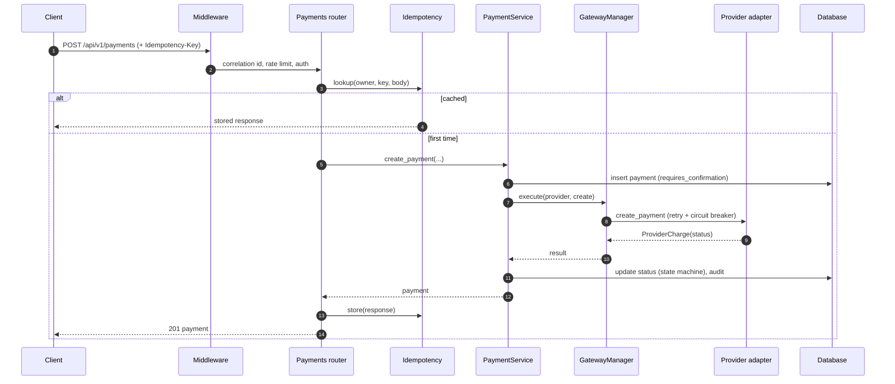
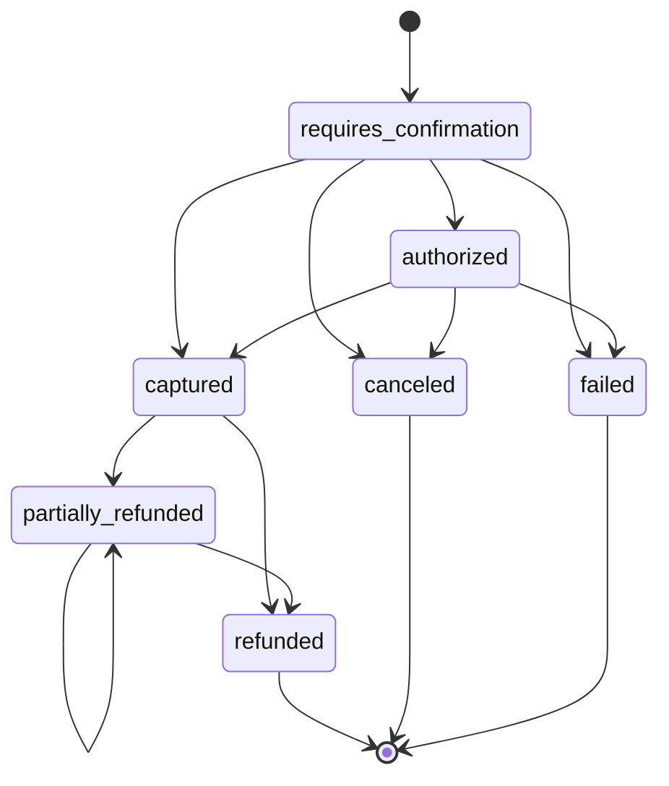
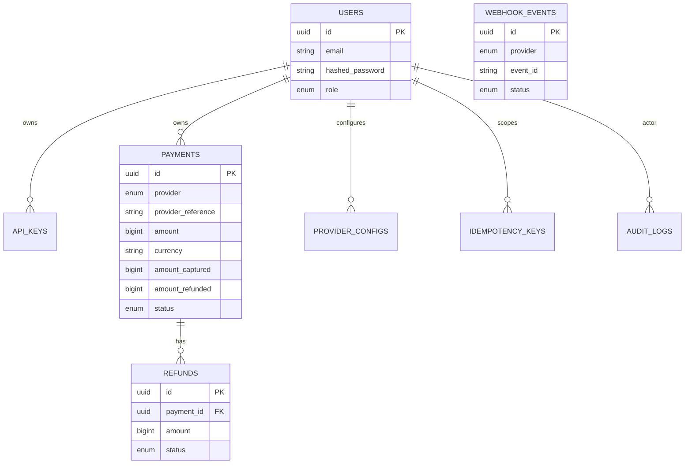

# Architecture

UPGI follows a **clean, layered architecture**. Dependencies point inward:
the domain and service layers never import the web framework or a provider SDK.
This keeps business rules testable in isolation and lets the outer layers
(HTTP, database, provider transport) change without rippling inward.

## Layers

| Layer | Package | Responsibility | Depends on |
|-------|---------|----------------|-----------|
| API | `app/api` | HTTP routing, request/response validation, DI wiring, error mapping | services, schemas |
| Schemas | `app/schemas` | Pydantic contracts (the public API surface) | domain |
| Services | `app/services` | Orchestration & business rules | repositories, domain, providers (via manager) |
| Gateway Manager | `app/services/gateway_manager.py` | Facade over providers + resilience | providers, security |
| Providers | `app/providers` | Adapters translating the unified interface to a gateway | domain, security |
| Repositories | `app/repositories` | Persistence (only layer touching the ORM) | db |
| Domain | `app/domain` | Enums, RBAC scopes, payment state machine | core |
| Core | `app/core` | Config, logging, money, errors, resilience, metrics | — |
| Security | `app/security` | Passwords, JWT, API keys, crypto, SSRF, signatures | core |

## Request flow (create payment)

## Payment state machine

Transitions are centralised in `app/domain/state_machine.py`; the service layer
calls `assert_transition` before persisting, so illegal jumps are impossible.

## Data model (ER)

## Resilience

Every outbound provider call is wrapped by the Gateway Manager:

- **Retry** — exponential backoff with full jitter, only for transient
  (infrastructure) failures.
- **Circuit breaker** — per provider; opens after N consecutive infra failures
  and fails fast until a cool-off elapses. **Business declines never trip it**,
  so a wave of legitimately declined cards does not take a provider offline.

## Extensibility

The provider **registry + factory** (`app/providers/registry.py`) is a plugin
seam: an adapter registers itself with a decorator and becomes resolvable by
name. The system is **open for extension, closed for modification** — new
providers, currencies, and payment methods are additive.
